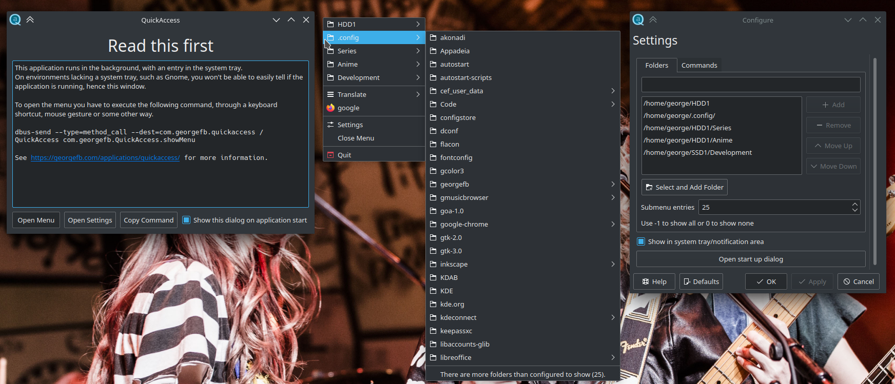

1. [Introduction](#introduction)
2. [Installation](#installation)
3. [Usage](#usage)
    * [Open Menu](#open-menu)
    * [Open Settings](#open-settings)
    * [Add Folder](#add-folder)
    * [Add Command](#add-command)
    * [Group Commands](#group-commands)
4. [Dependencies](#dependencies)
5. [Build](#build)

----

[](data/images/quickaccess.png)


# Introduction
**QuickAccess** is a program running in the background providing a global menu to quickly access user defined folders and their subfolders as well as creating and running custom commands.

The menu can be opened through two dbus methods: showMenu and showDelayedMenu.

Both methods can open the menu in a predefined fixed position or on mouse position. 

**showMenu** shows the menu instantly, but in certain circumstances there are problems with the menu not showing or not closing. In these cases use the **showDelayedMenu**, there is a default delay of 150 miliseconds, but can be changed (see example below).

# Installation
Easiest way to install is through [flatpak](https://flathub.org/apps/details/com.georgefb.quickaccess), flatpaks should work on all distros.

[Flatpak setup guide](https://flatpak.org/setup/)
```
flatpak install flathub com.georgefb.quickaccess
flatpak run com.georgefb.quickaccess
```

If you don't like flatpak you can build from source or ask the your distro to provide a package.

# Usage

### Open Menu
```bash
# with qdbus
qdbus com.georgefb.quickaccess /QuickAccess showMenu x
qdbus com.georgefb.quickaccess /QuickAccess showDelayedMenu 200 x
```

```bash
# with dbus-send
dbus-send --type=method_call --dest=com.georgefb.quickaccess /QuickAccess com.georgefb.QuickAccess.showMenu int32:x
dbus-send --type=method_call --dest=com.georgefb.quickaccess /QuickAccess com.georgefb.QuickAccess.showDelayedMenu int32:200 int32:x
```

replace x with a number from 0 to 9 to set the preffered position where the menu should open.

- 0 - mouse position (default)
- 1 - top left
- 2 - top hcenter
- 3 - top right
- 4 - vcenter left
- 5 - center
- 6 - vcenter rigth
- 7 - bottom left
- 8 - bottom hcenter
- 9 - bottom right

### Open Settings
- Open menu > click "Settings"
- Right click tray icon > click "Settings"

### Add Folder
- Open Settings
- Type full path of the folder in the text field and click "Add"
- Or
- Click "Select and Add Folder" and select a folder
- Click "Apply" or "OK" to save the settings

### Add Command
- Open Settings
- Click "Add Command"
- Fill the fields
- **Name**: text to be displayed in the menu
- **Icon**: name of the icon to be displayed in menu
- **Process**: name of the process/executable or path to script to be executed
- **Arguments**: arguments to be passed to the process, use **{clipboard}** to get the clipboard's text
- Click "OK" to add the command
- Click "Apply" or "OK" to save the settings

### Group Commands
- Open Settings
- Click "Add Menu"
- Enter a name
- Click "OK" to add the menu
- Drag commands on top of the menu
- Click "Apply" or "OK" to save the settings


[KDE Plasma shortcut example:](https://docs.kde.org/trunk5/en/kde-workspace/kcontrol/khotkeys/shortcuts.html)


# Dependencies
- Extra CMake Modules
- Qt5 Widgets
- Qt5 DBus
- KF5 I18n
- KF5 Config
- KF5 XmlGui

## Install dependencies

### Ubuntu
```
sudo apt install build-essential cmake extra-cmake-modules qtbase5-dev libkf5config-dev libkf5i18n-dev libkf5xmlgui-dev
```

### Fedora 
```
dnf install @development-tools extra-cmake-modules qt5-devel kf5-kconfig-devel kf5-ki18n-devel kf5-kxmlgui-devel
```

### Solus
```
sudo eopkg it -c system.devel extra-cmake-modules qt5-base-devel kconfig-devel ki18n-devel kxmlgui-devel
```

# Build
```bash
git clone https://gitlab.com/g-fb/quickaccess
cd quickaccess
# append `-D CMAKE_INSTALL_PREFIX:PATH=/your/custom/path` to install to a custom location
cmake -B build -G Ninja
cmake --build build
# run
./build/src/quickaccess
# install
cmake --install build
```
